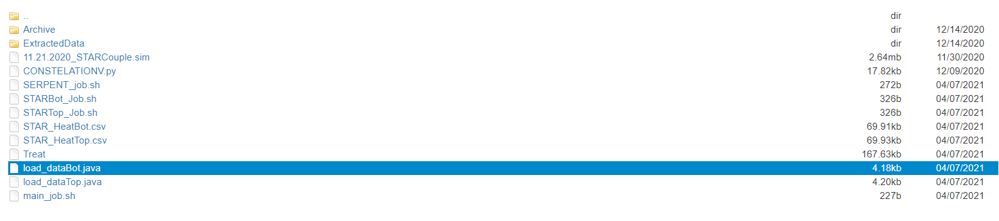

# CONSTELATION
Couples STAR-CCM+ and Serpent 2 for helium-3 injection into TREAT and OSTR


Originally created by Cole Leingang in 2021. Modified by Austin Warren in 2022.

## Documentation:
This document details the inputs and usage for the CONSTELATION coupling script. In the *Documentation* folder, there are other files which cover the individual inputs and usage for the Serpent 2 and STAR-CCM+ portions.

## Requirements:
- Python 3 (originally written in 2.7)
- Serpent 2 (version number here)
- STAR-CCM+ (version number here)

## Usage:
The **CONSTELATION** Python script couples STAR-CCM+ and Serpent 2 by managing the interfacing files and re-formatting data. This document will not discuss the creation of the Serpent 2 and STAR-CCM+ models. More discussion on how to use STAR-CCM+ and Serpent 2 models can be found in *`Documentation/STAR-model.md`* and *`Documentation/Serpent-model.md`*, respectively.

To use **CONSTELATION**, you will need to have the Serpent 2 and STAR-CCM+ simulations ready to run with the correct file names and paths provided to the **CONSTELATION** script. Separate documentation is provided for setting up the simulations, found in the *`Documentation/`* folder. Run the script with Python on the computer or cluster of your choice and it will begin the simulations. 
```console
user@cluster:~$ python CONSTELATION_3.py
```
**CONSTELATION** will queue the jobs on the cluster by submitting job scripts. These job scripts will need to be compatible with whatever server or cluster is being used to run this simulation. Examples are included in this package for use on Idaho National Laboratory's (INL) Sawtooth cluster.
### File Structure
Below is an example of the required file structure to use **CONSTELATION**.



## Modifications:
To use this script with a different Serpent 2 input file, simply change the file in the `file_in` variable, as seen below. The adjusted Serpent 2 input file name can be changed using the `file_out` variable in a similar manner.
```python
file_in = open(r'Treat',r)
```
```python
file_in = open(r'ostr',r)
```
Other file names you may want to change include:
- *.ifc* files
- Extracted data *.csv* files
- Serpent detetector files (if you changed the input file name from `'coupledTreat'`)

**CONSTELATION** was originally written to couple two separate STAR-CCM+ simulations. If you wish to couple a different number of simulations, then the script must be modified. The *`ostr_CONSTELATION_3.py`* file provides an example with only one STAR-CCM+ simulation.